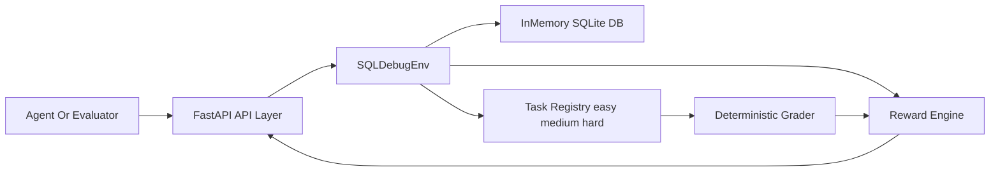
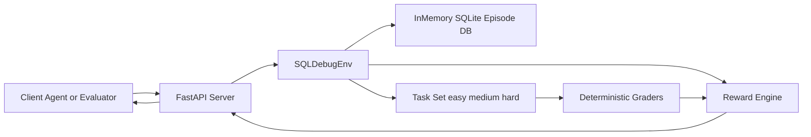

# SQL Debug Environment (`sql-debug-env`)


**Deterministic OpenEnv benchmark for real SQL debugging workflows.**

**Quick links:** [Live Space](https://md896-sql-debug-env.hf.space) · [Swagger](https://md896-sql-debug-env.hf.space/docs) · [OpenAPI](https://md896-sql-debug-env.hf.space/openapi.json) · [GitHub](https://github.com/mdayan8/sql-debug-env)

An OpenEnv environment focused on a real engineering workflow: **SQL query debugging**.
Agents iterate on broken SQL using schema/error/sample inspection until they produce the expected result.

## Space Config
| Key | Value |
|---|---|
| `title` | `sql-debug-env` |
| `emoji` | `🧪` |
| `colorFrom` | `blue` |
| `colorTo` | `green` |
| `sdk` | `docker` |
| `pinned` | `false` |

## Abstract
This project implements a deterministic OpenEnv benchmark for SQL debugging. It includes three graded tasks (easy -> medium -> hard), typed action/observation/reward models, dense reward shaping, reproducible behavior, Docker deployment, and a baseline inference runner that emits strict structured logs.

## Why this matters
- SQL debugging is a daily task in analytics and backend teams.
- Deterministic graders allow fair model comparison.
- Dense reward shaping supports step-by-step agent learning.
- Fast local runtime enables quick iteration and validation.

## Core Components
- **API layer**: `server/main.py`
- **Environment engine**: `server/env.py`
- **Episode database**: `server/database.py` (in-memory SQLite)
- **Typed models**: `server/models.py`
- **Reward logic**: `server/reward.py`
- **Task + graders**: `server/tasks/`
- **Baseline runner**: `inference.py`

## Architecture


## API Surface
- `POST /reset`
- `POST /step`
- `GET /state`
- `GET /tasks`
- `GET /health`
- `GET /benchmark`

## API Docs
- Swagger UI: `http://localhost:7860/docs`
- ReDoc: `http://localhost:7860/redoc`
- OpenAPI: `http://localhost:7860/openapi.json`

## Action Space
| Action | Required fields | Purpose |
|---|---|---|
| `submit_query` | `query` | Submit SQL candidate for execution + grading |
| `inspect_schema` | none | Return schema metadata |
| `inspect_error` | none | Return last execution error details |
| `inspect_sample` | `table_name` | Return sample rows from table |
| `reset_query` | none | Reset current query to original broken query |

## Observation Space (high-level)
- Task context: `task_id`, `task_description`, `original_query`, `expected_description`
- Progress: `steps_taken`, `steps_remaining`, `current_score`
- Feedback: `last_action_type`, `last_query_result`, `schema_info`, `error_details`, `sample_rows`
- Episode status: `is_done`, `success`

## Reward Design
Reward is clamped to `[0.0, 1.0]` and combines:
- `correctness` (`0.0-0.6`)
- `efficiency` (`0.0-0.2`)
- `syntax_progress` (`0.0-0.1`)
- `schema_bonus` (`0.0-0.1`)
- `penalty` deduction magnitude (`0.0-0.2`)

## Task Suite
### Easy — `easy_syntax_fix`
Fix a misspelled SQL keyword and alias mismatch.

### Medium — `medium_logic_fix`
Fix join/filter placement and aggregation scope issues.

### Hard — `hard_multi_bug`
Fix multi-part bugs across correlation, date logic, and aggregation/window behavior.

## Repository Structure
```text
sql-debug-env/
├── Dockerfile
├── openenv.yaml
├── inference.py
├── README.md
├── requirements.txt
├── pyproject.toml
├── uv.lock
├── scripts/
│   └── benchmark_local.py
├── server/
│   ├── main.py
│   ├── env.py
│   ├── models.py
│   ├── database.py
│   ├── reward.py
│   └── tasks/
│       ├── base.py
│       ├── task_easy.py
│       ├── task_medium.py
│       └── task_hard.py
└── tests/
    ├── test_env.py
    ├── test_graders.py
    └── test_reward.py
```

## Reliability and Benchmarking
### Verified local status
- `openenv validate --verbose`: PASS
- `python3 -m unittest discover -s tests -p "test_*.py"`: 10/10 PASS
- Docker smoke test: PASS (`/health`, `/tasks`, `/reset`, `/step`)

### Live benchmark endpoint
`GET /benchmark?runs=20` performs fresh timing each call.

Example:
```bash
curl "http://localhost:7860/benchmark?runs=20"
```

## Quick Start
### Local
```bash
pip install -r requirements.txt
uvicorn server.main:app --host 0.0.0.0 --port 7860
```

### Docker
```bash
docker build -t sql-debug-env .
docker run -p 7860:7860 sql-debug-env
```

### Smoke test
```bash
curl http://localhost:7860/health
curl http://localhost:7860/tasks
curl -X POST http://localhost:7860/reset -H "Content-Type: application/json" -d '{}'
curl -X POST http://localhost:7860/step -H "Content-Type: application/json" -d '{"action":{"action_type":"inspect_schema"}}'
curl "http://localhost:7860/benchmark?runs=20"
```

## Baseline Inference
```bash
export API_BASE_URL="https://api.openai.com/v1"
export MODEL_NAME="gpt-4o-mini"
export OPENAI_API_KEY="your-key"
export HF_TOKEN="$OPENAI_API_KEY"
export ENV_BASE_URL="http://localhost:7860"
export SEED="1"
python inference.py
```

## Hugging Face Spaces (Docker)
1. Create Docker Space.
2. Push this repository.
3. Ensure `openenv.yaml` has:
   `api.base_url: "https://md896-sql-debug-env.hf.space"`
4. Verify:
```bash
curl https://md896-sql-debug-env.hf.space/health
curl -X POST https://md896-sql-debug-env.hf.space/reset -H "Content-Type: application/json" -d '{}'
curl https://md896-sql-debug-env.hf.space/docs
```
---
title: sql-debug-env
emoji: "🧪"
colorFrom: blue
colorTo: green
sdk: docker
pinned: false
---

# SQL Debug Environment (`sql-debug-env`)


An OpenEnv environment for a real task people do every day: **debugging SQL**. The agent gets a broken query, a live (in-memory) SQLite database, and a description of the expected output. It can inspect schema/errors/samples and submit fixed queries until it solves the task.

## Space Config
| Key | Value |
|---|---|
| `title` | `sql-debug-env` |
| `emoji` | `🧪` |
| `colorFrom` | `blue` |
| `colorTo` | `green` |
| `sdk` | `docker` |
| `pinned` | `false` |

## Why this project matters
- SQL debugging is a real operational task across analytics and backend teams.
- The environment is deterministic, fast, and local-first for reliable evaluation.
- Reward shaping gives useful partial progress signals instead of only pass/fail.
- The benchmark endpoint provides live runtime evidence for reviewers.

## What’s in this repo
- **FastAPI server**: `server/main.py` (endpoints: `/health`, `/tasks`, `/reset`, `/step`, `/state`)
- **Environment logic**: `server/env.py` + `server/database.py`
- **Tasks**: `server/tasks/` (easy → medium → hard, deterministic seed data)
- **Baseline agent**: `inference.py` (OpenAI client + `[START]/[STEP]/[END]` logs)

## Tech Stack
- Python 3.11+
- FastAPI + Uvicorn
- Pydantic v2
- SQLite (in-memory)
- OpenEnv Core
- Docker
- OpenAI Python SDK (baseline inference)

## Production Notes
- Stateless HTTP API with per-session environment instances keyed by `X-Session-Id`
- Deterministic task data (in-memory SQLite) for reproducible grading
- Reward clamped to `[0.0, 1.0]` with partial-progress shaping
- Docker-first deployment path (local and Hugging Face Spaces)
- Local benchmark endpoint for live latency checks (`/benchmark`)

## Architecture


## API Docs (FastAPI Auto Docs)
Use these for interactive testing in browser:

- Swagger UI: `http://localhost:7860/docs`
- ReDoc: `http://localhost:7860/redoc`
- OpenAPI spec: `http://localhost:7860/openapi.json`

## Project Structure
```text
sql-debug-env/
├── Dockerfile
├── openenv.yaml
├── inference.py
├── README.md
├── requirements.txt
├── pyproject.toml
├── uv.lock
├── scripts/
│   └── benchmark_local.py
├── server/
│   ├── main.py
│   ├── env.py
│   ├── models.py
│   ├── database.py
│   ├── reward.py
│   └── tasks/
│       ├── base.py
│       ├── task_easy.py
│       ├── task_medium.py
│       └── task_hard.py
└── tests/
    ├── test_env.py
    ├── test_graders.py
    └── test_reward.py
```

## Action Space
| Action | Required fields | Cost / reward effect |
|---|---|---|
| `submit_query` | `query` | Main evaluation step (dense reward based on grading) |
| `inspect_schema` | none | Free information action (small positive reward component) |
| `inspect_error` | none | Free information action (small positive reward component) |
| `inspect_sample` | `table_name` | Free information action (small positive reward component) |
| `reset_query` | none | Penalty action (reduces reward for that step) |

## Observation Space
| Field | Type |
|---|---|
| `task_id` | `string` |
| `task_description` | `string` |
| `original_query` | `string` |
| `current_query` | `string_or_null` |
| `expected_description` | `string` |
| `last_action_type` | `string` |
| `last_query_result` | `object_or_null` |
| `steps_taken` | `integer` |
| `steps_remaining` | `integer` |
| `current_score` | `float` |
| `schema_info` | `object_or_null` |
| `error_details` | `string_or_null` |
| `sample_rows` | `array_or_null` |
| `hint` | `string_or_null` |
| `is_done` | `boolean` |
| `success` | `boolean` |

## Reward Function
| Component | Range | Description |
|---|---|---|
| `correctness` | `[0.0, 0.6]` | Row-level match vs expected output |
| `efficiency` | `[0.0, 0.2]` | Bonus for solving with fewer steps |
| `syntax_progress` | `[0.0, 0.1]` | Small reward for producing syntactically valid SQL |
| `schema_bonus` | `[0.0, 0.1]` | Bonus for referencing correct tables/columns |
| `penalty` | `[0.0, 0.2]` | Deduction magnitude for resets/regressions/urgency near step limit |

## Tasks
### Task 1: Easy — Syntax Error Fix (`easy_syntax_fix`)
Two straightforward issues: a misspelled keyword (`GRUP BY`) and an `ORDER BY` alias mismatch.

### Task 2: Medium — Logic Error Fix (`medium_logic_fix`)
Logic bugs around outer joins + filtering scope + aggregation scope.

### Task 3: Hard — Multi-Bug Fix (`hard_multi_bug`)
Five bugs across correlated subqueries, window functions, CTE scope, date logic, and duplication.

## Baseline
The baseline script is intentionally simple: it loops `reset → step` and asks an OpenAI model to choose the next JSON action.

## Reliability & Benchmarking

### Verified status (local)
- `openenv validate --verbose`: **PASS**
- `python3 -m unittest discover -s tests -p "test_*.py"`: **10/10 PASS**
- Docker smoke test: **PASS** (`/health`, `/tasks`, `/reset`, `/step`)
- FastAPI docs available: **PASS** (`/docs`, `/redoc`, `/openapi.json`)

### Endpoint benchmark (local Docker run, n=25)
Measured with `scripts/benchmark_local.py` on a running local container:

| Endpoint | avg | p50 | p95 |
|---|---:|---:|---:|
| `GET /health` | 0.69 ms | 0.67 ms | 0.76 ms |
| `GET /tasks` | 0.82 ms | 0.81 ms | 0.90 ms |
| `POST /reset` | 1.34 ms | 1.26 ms | 1.62 ms |
| `POST /step` (`inspect_schema`) | 1.07 ms | 1.01 ms | 1.34 ms |

Re-run anytime:

```bash
python3 scripts/benchmark_local.py
```

Notes:
- These are local-machine numbers (single container, warm runtime).
- For submission-grade reporting, also capture one run against your HF Space URL after deploy.

## Setup & Usage

### Local Development
```bash
pip install -r requirements.txt
uvicorn server.main:app --host 0.0.0.0 --port 7860
```

### Docker
```bash
docker build -t sql-debug-env .
docker run -p 7860:7860 sql-debug-env
```

### Quick smoke test
```bash
curl http://localhost:7860/health
curl http://localhost:7860/tasks
curl -X POST http://localhost:7860/reset -H "Content-Type: application/json" -d '{"task_id":"easy_syntax_fix"}'
curl -X POST http://localhost:7860/step  -H "Content-Type: application/json" -d '{"action":{"action_type":"inspect_schema"}}'
curl "http://localhost:7860/benchmark?runs=20"
```

### Real-time benchmark API (for dashboards/web pages)
This is a live endpoint, not static/dummy data. Every request runs fresh measurements.

- Endpoint: `GET /benchmark?runs=20`
- `runs` range: `1` to `100`
- Returns JSON with `avg_ms`, `p50_ms`, `p95_ms`, `n`, and a fresh `timestamp_epoch_ms`

Example:
```bash
curl "http://localhost:7860/benchmark?runs=30"
```

### Run Baseline
```bash
export API_BASE_URL="https://api.openai.com/v1"
export MODEL_NAME="gpt-4o-mini"
export OPENAI_API_KEY="your-key"
export ENV_BASE_URL="http://localhost:7860"
export HF_TOKEN="$OPENAI_API_KEY"
export SEED="1"
python inference.py
```

### OpenEnv Validation
```bash
pip install openenv-core
openenv validate
```

### Suggested pre-submit check
```bash
openenv validate --verbose
python3 -m unittest discover -s tests -p "test_*.py"
docker build -t sql-debug-env .
docker run --rm -p 7860:7860 sql-debug-env
# in another terminal:
curl -s http://localhost:7860/health
curl -s http://localhost:7860/docs >/dev/null
curl -s "http://localhost:7860/benchmark?runs=20"
```

## Hugging Face Spaces (Docker)
1. Create a new **Space → Docker**.
2. Push this repo.
3. Update `openenv.yaml` → `api.base_url` to your Space URL: `https://<your-space>.hf.space`
4. Wait for build, then verify:

```bash
curl -X POST https://<your-space>.hf.space/reset -H "Content-Type: application/json" -d '{}'
```

