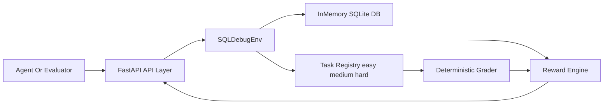

# SQL Debug Environment (`sql-debug-env`)


**Deterministic OpenEnv benchmark for real SQL debugging workflows.**

**Quick links:** [Live Space](https://md896-sql-debug-env.hf.space) · [Swagger](https://md896-sql-debug-env.hf.space/docs) · [OpenAPI](https://md896-sql-debug-env.hf.space/openapi.json) · [GitHub](https://github.com/mdayan8/sql-debug-env)

## Launch Blog

- [From SQL Guessing to SQL Execution: Building a Real Debugging Agent](docs/SQL_DEBUG_AGENT_LAUNCH_BLOG.md)

An OpenEnv environment for a real engineering workflow: SQL query debugging. Agents iterate on broken SQL using schema/error/sample inspection until they produce the expected result.

## 🏆 SQL Debug Agent: Self-Improving Database Intelligence

## 🚀 The Problem (Motivation)
SQL errors are the **"Hidden Tax"** of software development. Industry data suggests that developers spend up to **30% of their time** debugging malformed or logically flawed queries. 
*   **Static Linters** only catch syntax, not logic.
*   **LLMs** hallucinate schemas they haven't seen.
*   **Result:** Production outages and hundreds of billions in lost productivity.

Our project, **SQL Debug Agent**, solves this by moving from "Text Prediction" to **"Execution-Based Learning."**

## 🧠 The Innovation: RL-Enhanced Debugging
Instead of just guessing the next token, our agent was trained in a **live SQL sandbox** using **GRPO (Group Relative Policy Optimization).**
*   **Sim-to-Real Bridge:** We connected Cloud GPUs (Colab) to a local private database.
*   **Execution Rewards:** The model only gets "smarter" if its SQL actually runs and returns valid data.
*   **Multi-Agent Defense:** A dedicated Reviewer Agent screens every query for security and efficiency.

## Abstract
This project implements a deterministic OpenEnv benchmark for SQL debugging. It includes three graded tasks (easy -> medium -> hard), typed action/observation/reward models, dense reward shaping, reproducible behavior, Docker deployment, and a baseline inference runner with strict structured logs.

## Why this matters
- SQL debugging is a daily task in analytics and backend teams.
- Deterministic graders allow fair model comparison.
- Dense reward shaping supports step-by-step agent learning.
- Fast local runtime enables quick iteration and validation.

## Core Components
- API layer: `server/main.py`
- Environment engine: `server/env.py`
- Episode database: `server/database.py` (in-memory SQLite)
- Typed models: `server/models.py`
- Reward logic: `server/reward.py`
- Task + graders: `server/tasks/`
- Baseline runner: `inference.py`

## Architecture


## API Surface
- `POST /reset`
- `POST /step`
- `GET /state`
- `GET /tasks`
- `GET /health`
- `GET /benchmark`

## API Docs
- Swagger UI: `http://localhost:7860/docs`
- ReDoc: `http://localhost:7860/redoc`
- OpenAPI: `http://localhost:7860/openapi.json`

## Action Space
| Action | Required fields | Purpose |
|---|---|---|
| `submit_query` | `query` | Submit SQL candidate for execution + grading |
| `inspect_schema` | none | Return schema metadata |
| `inspect_error` | none | Return last execution error details |
| `inspect_sample` | `table_name` | Return sample rows from table |
| `reset_query` | none | Reset current query to original broken query |

## Reward Design
Reward is clamped to `[0.0, 1.0]` and combines:
- correctness (`0.0-0.6`)
- efficiency (`0.0-0.2`)
- syntax_progress (`0.0-0.1`)
- schema_bonus (`0.0-0.1`)
- penalty deduction magnitude (`0.0-0.2`)

## Task Suite
- Easy: `easy_syntax_fix`
- Medium: `medium_logic_fix`
- Hard: `hard_multi_bug`
- Expert: `hard_finance_explosion` (fan-trap / cartesian explosion)

## Repository Structure
```text
sql-debug-env/
├── Dockerfile
├── openenv.yaml
├── inference.py
├── README.md
├── requirements.txt
├── pyproject.toml
├── uv.lock
├── scripts/
│   └── benchmark_local.py
├── server/
│   ├── main.py
│   ├── env.py
│   ├── models.py
│   ├── database.py
│   ├── reward.py
│   └── tasks/
│       ├── base.py
│       ├── task_easy.py
│       ├── task_medium.py
│       ├── task_hard.py
│       └── task_finance_explosion.py
└── tests/
    ├── test_env.py
    ├── test_graders.py
    └── test_reward.py
```

## Reliability and Benchmarking
- `openenv validate --verbose`: PASS
- `python3 -m unittest discover -s tests -p "test_*.py"`: PASS
- Docker smoke test: PASS (`/health`, `/tasks`, `/reset`, `/step`)

Live benchmark endpoint:
```bash
curl "http://localhost:7860/benchmark?runs=20"
```

## Quick Start
### Local
```bash
pip install -r requirements.txt
uvicorn server.main:app --host 0.0.0.0 --port 7860
```

### Docker
```bash
docker build -t sql-debug-env .
docker run -p 7860:7860 sql-debug-env
```

### Baseline Inference
```bash
export API_BASE_URL="https://api.openai.com/v1"
export MODEL_NAME="gpt-4o-mini"
export OPENAI_API_KEY="your-key"
export HF_TOKEN="$OPENAI_API_KEY"
export ENV_BASE_URL="http://localhost:7860"
export SEED="1"
python inference.py
```

## Hugging Face Spaces
Verify deployment:
```bash
curl https://md896-sql-debug-env.hf.space/health
curl -X POST https://md896-sql-debug-env.hf.space/reset -H "Content-Type: application/json" -d '{}'
curl https://md896-sql-debug-env.hf.space/docs
```
