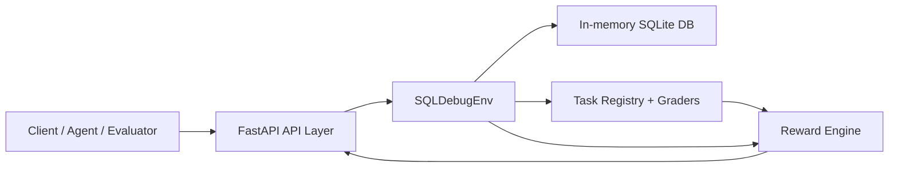

# SQL Debug Environment (`sql-debug-env`)


Deterministic OpenEnv benchmark for real SQL debugging workflows. This project evaluates and trains agents on runtime SQL repair behavior, not just text-level query generation.

## Quick Links

- Live Space: [https://md896-sql-debug-env.hf.space](https://md896-sql-debug-env.hf.space)
- Demo page: [https://md896-sql-debug-env.hf.space/demo](https://md896-sql-debug-env.hf.space/demo)
- Gradio app: [https://md896-sql-debug-env.hf.space/gradio/](https://md896-sql-debug-env.hf.space/gradio/)
- Swagger: [https://md896-sql-debug-env.hf.space/docs](https://md896-sql-debug-env.hf.space/docs)
- OpenAPI: [https://md896-sql-debug-env.hf.space/openapi.json](https://md896-sql-debug-env.hf.space/openapi.json)
- GitHub: [https://github.com/mdayan8/sql-debug-env](https://github.com/mdayan8/sql-debug-env)
- W&B dashboard: [https://wandb.ai/mdayanbag-pesitm/sql-debug-grpo-best-budget/workspace?nw=nwusermdayanbag](https://wandb.ai/mdayanbag-pesitm/sql-debug-grpo-best-budget/workspace?nw=nwusermdayanbag)

## Problem and Motivation

SQL debugging is expensive, repetitive, and operationally risky:

- static checks catch syntax, not business-logic correctness
- generated SQL can look plausible and still fail at execution time
- production schemas and data distribution shifts expose brittle query behavior

This environment is designed to optimize for execution-grounded correctness with deterministic tasks, explicit feedback, and repeatable benchmarks.

## Training Pipeline (How We Trained)

The project uses an execution-grounded RL loop where model outputs are scored by actual SQL runtime behavior.

| Stage | What happens | Output artifact |
|---|---|---|
| 1. Bridge run | Fast wiring validation on smaller model (0.5B track) | Session traces + first sanity metrics |
| 2. Baseline eval | Run base 7B model on the same deterministic tasks | Baseline benchmark charts |
| 3. RL training (GRPO) | Optimize policy with reward from SQL execution + grader signals | Trained checkpoints + W&B logs |
| 4. Hard-test eval | Re-run benchmark suite post-training | Delta charts + proof PNGs |
| 5. Publish | Push model + Space artifacts | HF model card + Space static evidence |

Training references:

- Colab training entrypoint: `colab_real_world.py`
- Job launcher: `launch_job.py`
- Main training/eval script: `ultimate_sota_training.py`
- W&B workspace: [sql-debug-grpo-best-budget](https://wandb.ai/mdayanbag-pesitm/sql-debug-grpo-best-budget/workspace?nw=nwusermdayanbag)

## Agent Workflow (How It Works)

At runtime, the agent does not "one-shot" SQL. It iterates through an environment loop:

1. `POST /reset` initializes a task and returns typed observation.
2. Agent proposes action (`submit_query`, `inspect_schema`, `inspect_error`, `inspect_sample`, `reset_query`).
3. `POST /step` executes action in isolated session state (in-memory SQLite).
4. Environment returns next observation + reward + done + info.
5. Loop repeats until done/timeout, with reward shaping encouraging valid, safe, task-correct SQL.

This design converts SQL debugging into a measurable control loop rather than prompt-only guessing.

## Benchmark Snapshot

| Metric snapshot | Value |
|---|---:|
| Spider chart: Industry baseline | 48.2% |
| Spider chart: Qwen-7B base | 52.4% |
| Spider chart: RL agent | 78.5% |
| Performance leap view | 0.0% -> 25.0% |
| Eval artifact pass | 32-run |

## Benchmark Themes and Failure Classes

### Task themes

| Theme | Representative task | Typical difficulty driver |
|---|---|---|
| Syntax repair | `easy_syntax_fix` | Broken tokens / malformed SQL |
| Logic and grouping | `medium_logic_fix` | Aggregation correctness |
| Multi-bug joins | `hard_multi_bug` | Alias/join/key mismatch |
| Finance/cartesian risk | `hard_finance_explosion` | Fan-trap joins, unsafe blow-ups |

### Common failure classes tracked

| Failure class | Symptom | Why execution feedback matters |
|---|---|---|
| Schema mismatch | Unknown table/column | Immediate error + corrective signal |
| Join logic bug | Duplicated/missing rows | Captures semantic correctness beyond syntax |
| Aggregation drift | Wrong totals / GROUP BY | Deterministic graders expose numeric error |
| Unsafe behavior | Risky or invalid query path | Reviewer/guardrail can block while preserving signal |
| Hallucinated structure | Invented fields/relations | Penalized by execution + schema checks |

## Proof and Evidence Artifacts

### End-to-end environment map


### Core benchmark visuals


### Training and evaluation proofs


### Run folders and model

- Sample rewards (32 eval): [HF artifacts folder](https://huggingface.co/spaces/md896/sql-debug-env/tree/main/artifacts/runs/20260426-064318-sample-rewards-32eval)
- Earlier 32-eval pass: [HF artifacts folder](https://huggingface.co/spaces/md896/sql-debug-env/tree/main/artifacts/runs/20260426-060502-final-pass-32eval)
- Model card: [md896/sql-debug-agent-qwen25-05b-grpo-wandb-continue-v2](https://huggingface.co/md896/sql-debug-agent-qwen25-05b-grpo-wandb-continue-v2)

## System Architecture



Core components:

- API layer: `server/main.py`
- Environment engine: `server/env.py`
- Episode DB: `server/database.py`
- Typed models: `server/models.py`
- Reward logic: `server/reward.py`
- Task + graders: `server/tasks/`
- Baseline runner: `inference.py`

## OpenEnv Contract and Action Space

API surface:

- `POST /reset`
- `POST /step`
- `GET /state`
- `GET /tasks`
- `GET /health`
- `GET /benchmark`

Actions:

| Action | Required fields | Purpose |
|---|---|---|
| `submit_query` | `query` | Execute/grade SQL candidate |
| `inspect_schema` | none | Return schema metadata |
| `inspect_error` | none | Return last execution error |
| `inspect_sample` | `table_name` | Return sample rows |
| `reset_query` | none | Restore original broken query |

Reward (clamped to `[0.0, 1.0]`) blends:

- correctness (`0.0-0.6`)
- efficiency (`0.0-0.2`)
- syntax_progress (`0.0-0.1`)
- schema_bonus (`0.0-0.1`)
- penalties (`0.0-0.2` magnitude)

## Task Suite

- Easy: `easy_syntax_fix`
- Medium: `medium_logic_fix`
- Hard: `hard_multi_bug`
- Expert: `hard_finance_explosion` (fan-trap/cartesian explosion)

## Reliability and Validation

- `openenv validate --verbose`: PASS
- `python3 -m unittest discover -s tests -p "test_*.py"`: PASS
- Docker smoke checks: PASS (`/health`, `/tasks`, `/reset`, `/step`)

Live benchmark example:

```bash
curl "http://localhost:7860/benchmark?runs=20"
```

## Quick Start

### Local

```bash
pip install -r requirements.txt
uvicorn server.main:app --host 0.0.0.0 --port 7860
```

### Docker

```bash
docker build -t sql-debug-env .
docker run -p 7860:7860 sql-debug-env
```

### Baseline Inference

```bash
export API_BASE_URL="https://api.openai.com/v1"
export MODEL_NAME="gpt-4o-mini"
export OPENAI_API_KEY="your-key"
export HF_TOKEN="$OPENAI_API_KEY"
export ENV_BASE_URL="http://localhost:7860"
export SEED="1"
python inference.py
```

## Repository Structure

```text
sql-debug-env/
├── Dockerfile
├── openenv.yaml
├── README.md
├── requirements.txt
├── pyproject.toml
├── uv.lock
├── inference.py
├── launch_job.py
├── presentation_graphs.py
├── server/
│   ├── main.py
│   ├── gradio_ui.py
│   ├── demo_page.html
│   ├── env.py
│   ├── models.py
│   ├── database.py
│   ├── reward.py
│   ├── static/
│   └── tasks/
└── tests/
```
