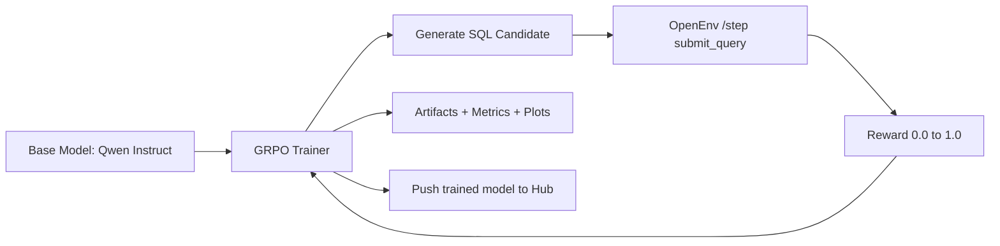

# From SQL Guessing to SQL Execution: Building a Real Debugging Agent

Most AI SQL assistants still behave like autocomplete tools: they sound confident, but they do not prove that their SQL works.

This project takes a different route. We built a deterministic SQL debugging environment, connected it to reinforcement learning, and trained the agent against live execution rewards rather than style-only feedback.

The goal is simple and practical: make an agent that can fix broken production-style SQL under real constraints, not just generate syntactically nice-looking queries.

## Why We Built This

SQL failures in real systems are rarely only syntax problems. They are often:

- join logic mistakes
- aggregation bugs
- fan-trap or cartesian explosions
- schema misunderstandings

A text-only model can produce polished answers that still fail at execution time. So we designed a loop where the model is rewarded only when the SQL actually executes and scores well in a deterministic grader.

## What We Built

At the core is `sql-debug-env`, an OpenEnv benchmark and API with live task execution:

- live Space: [md896/sql-debug-env](https://huggingface.co/spaces/md896/sql-debug-env)
- health endpoint: `/health`
- training endpoints: `/tasks`, `/reset`, `/step`

The training pipeline runs with GRPO and calls the environment reward endpoint for every sampled completion.



## Training System Upgrades We Implemented

To make this production-grade and stable on Hugging Face Jobs, we implemented:

- strict dependency pinning for `transformers`, `accelerate`, and `trl`
- CUDA generation stability guards (`remove_invalid_values`, `renormalize_logits`, bf16 on GPU)
- full model save/push (not LoRA-only output)
- automatic artifact upload back to Space repo
- explicit base-vs-trained evaluation on hard tasks
- per-task and distribution-level performance visualizations

## The Data and Graphs We Publish

Every run exports a reproducible artifact bundle:

- `train_log_history.jsonl`
- `train_metrics.json`
- `reward_curve.png`
- `before_after_avg_reward.png`
- `performance_comparison.png`
- `reward_distribution_shift.png`


## Current Status

The live environment is healthy and reachable:

```json
{"name":"sql-debug-env","status":"ok","message":"Use /health, /tasks, /reset, /step, /state, /benchmark"}
```

Our shorter earlier run showed near-flat sampled average reward (around 0.10 baseline vs ~0.10 post-train), which is exactly why we escalated to a longer 7B run.

The current long run is configured for stronger learning pressure:

- model: `Qwen/Qwen2.5-7B-Instruct`
- steps: `600`
- rows per task: `96`
- hard eval samples: `24`
- task eval samples: `24`

## Why This Matters

This is not just a benchmark demo. It is a practical pattern for training agents that must survive real execution constraints:

1. deterministic environment
2. execution-grounded rewards
3. hard-task evaluation, not only aggregate averages
4. artifact-first reproducibility

That combination gives us a path from “looks good” to “actually works.”

## How To Reproduce

1. Run environment (local or Space)
2. Launch training job with `launch_job.py`
3. Monitor Hugging Face Job logs
4. Read `train_metrics.json` and inspect all generated plots
5. Compare base vs trained per task, then iterate

## What We Will Publish Next

Once the long run finishes, we will append:

- final per-task rewards
- hard-task delta (`hard_finance_explosion`)
- direct model link for the trained checkpoint
- artifact run path with all plots

## Final Takeaway

Execution-based RL for SQL debugging is harder than prompt tuning, but it is the right difficulty. If the target is production reliability, the model must be trained in an environment that can say “this query failed” with zero ambiguity.

That is exactly what this system does.
