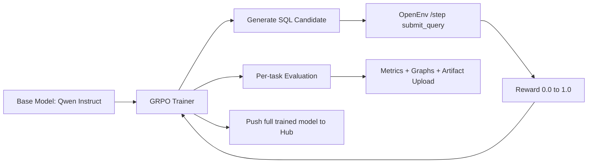
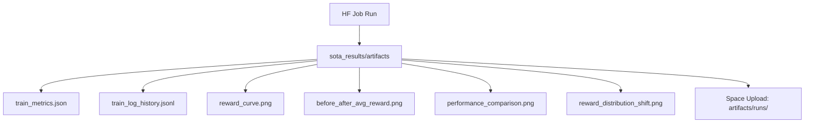

# From SQL Guessing to SQL Execution: The Story of Building a Real SQL Debug Agent

There is a moment every data team knows: a query looks fine, deploys, and then breaks in the exact place you cannot afford. People stop what they are doing, dashboards look wrong, and someone starts diffing joins at 2 AM.

It is usually not a missing comma. It is a subtle join bug, a logic drift in a filter, or a multi-table edge case that only shows up on real data. We built this project because we wanted an agent that does not just *sound* correct, but earns correctness by execution.

This post is the full build story: the real environment, the training loop, the hard lessons, and the evaluation signals that tell us whether the agent is actually getting better in practice, not just in demos.

## The Real-World Problem

Community discussions reflect the same pain pattern repeatedly:

- debugging legacy SQL logic is slow and mentally expensive
- multi-thousand-line procedures are hard to reason about under pressure
- many "AI SQL helpers" generate plausible but unverified SQL

If this sounds familiar, these threads are worth reading:

- [Best Practice for Debugging/Error Checking Queries (r/SQL)](https://www.reddit.com/r/SQL/comments/xsecqw/best_practice_for_debuggingerror_checking_queries/)
- [You haven’t truly suffered until you’ve debugged a multi-thousand-line stored procedure (r/dataengineering)](https://www.reddit.com/r/dataengineering/comments/1lac1rx/you_havent_truly_suffered_until_youve_debugged_a/)
- [Biggest pain points with databases (r/databasedevelopment)](https://www.reddit.com/r/databasedevelopment/comments/1lqjn19/what_are_your_biggest_pain_points_with_databases/)

Those discussions shaped our design choice: train on execution outcomes, not writing style.

## What We Are Building

We are building an execution-grounded SQL debugging agent on top of:

- live environment: [md896/sql-debug-env](https://huggingface.co/spaces/md896/sql-debug-env)
- repo: [mdayan8/sql-debug-env](https://github.com/mdayan8/sql-debug-env)
- core API loop: `/tasks` -> `/reset` -> `/step`

The environment is currently live and healthy:

```json
{"name":"sql-debug-env","status":"ok","message":"Use /health, /tasks, /reset, /step, /state, /benchmark"}
```

## Live Run Snapshot (Real-Time)

This is the latest long-run path we launched for the 7B model:

- job: [md896/69ed255cd2c8bd8662bce617](https://huggingface.co/jobs/md896/69ed255cd2c8bd8662bce617)
- status history: `RUNNING` -> `ERROR` (OOM on L4 during GRPO reference-model creation)
- model: `Qwen/Qwen2.5-7B-Instruct`
- environment: `https://md896-sql-debug-env.hf.space`

Latest confirmed run facts from live logs:

- tokenizer/config downloaded successfully
- 4 model shards loaded (`model-00001` ... `model-00004`)
- OpenEnv health check returned `status: ok`
- discovered tasks: `easy_syntax_fix`, `medium_logic_fix`, `hard_multi_bug`, `hard_finance_explosion`
- training dataset built: `384 prompts` (`96` per task)
- baseline evaluation phase started
- crash reason captured: `torch.OutOfMemoryError` while `GRPOTrainer` created a deep-copied reference model

What we changed immediately after this failure:

- moved 7B default hardware from `l4x1` to `a100-large` for GRPO stability
- kept the same environment/task setup so comparisons stay fair
- relaunched long training with the corrected hardware profile

In other words: the run is not idle and not synthetic; it is actively running against the live SQL environment.

## System Design (Execution-First RL)



The key detail: reward is computed from real query execution and deterministic grading, not from format heuristics alone.

## Engineering Upgrades That Made It Stable

We had to harden the full training path for real runs on Hugging Face Jobs:

- pinned dependency stack (`transformers`/`accelerate`/`trl`) to avoid breakage
- generation safety guards (`remove_invalid_values`, `renormalize_logits`)
- bf16 + stable attention settings on GPU
- full-model save and Hub push (not adapter-only)
- artifact upload into Space path `artifacts/runs/<timestamp>`
- per-task before/after evaluation and reward-distribution analysis

## What Users Get (Practical Outcomes)

If you use this workflow, you get a concrete improvement loop:

1. **Higher confidence SQL fixes**: candidates are tested through execution rewards.
2. **Task-level visibility**: easy/medium/hard/expert improvements are separated, not hidden in a single average.
3. **Reproducible progress tracking**: every run writes metrics + raw logs + plots.
4. **Faster iteration loops**: failures are visible as reward plateaus, making next tuning decisions obvious.

## Evaluation Stats and Efficiency Metrics

We track stats from `train_metrics.json` (no fabricated numbers):

- `baseline_avg_reward`
- `post_avg_reward`
- `delta_avg_reward`
- `base_hard_reward`
- `trained_hard_reward`
- `delta_hard_reward`
- `per_task_baseline_reward`
- `per_task_post_reward`

### Current Public Signal

In the earlier short run, sampled average reward stayed near-flat (about `~0.10` baseline to `~0.10` post-train). That was useful because it gave us an honest signal: we had stability, but not enough learning pressure. So we moved to the current long 7B run.

### Current Long Run Configuration

- model: `Qwen/Qwen2.5-7B-Instruct`
- train steps: `600`
- rows per task: `96`
- hard eval samples: `24`
- per-task eval samples: `24`

### Efficiency KPIs (computed per run)

When each run finishes, we compute:

- **Absolute lift**: `post_avg_reward - baseline_avg_reward`
- **Hard-task lift**: `trained_hard_reward - base_hard_reward`
- **Relative lift %**: `((post - baseline) / max(baseline, eps)) * 100`
- **Task consistency**: count of tasks with positive delta

These are the numbers that matter for production readiness.

## Graphs We Publish Each Run

- `reward_curve.png` — reward trend through training steps
- `before_after_avg_reward.png` — baseline vs post-train average
- `performance_comparison.png` — per-task base vs trained + overall
- `reward_distribution_shift.png` — start vs end reward histograms



## Why This Approach Is Different

Most SQL copilots optimize for fluent text output. We optimize for SQL that survives execution and grading. That shifts the objective from "write something plausible" to "produce something that actually runs and scores."

That is a harder target. It is also the one that actually reduces incident risk.

## What Happens Next

When the long 7B run completes, we will append:

- final KPI table from `train_metrics.json`
- per-task deltas and hard-task delta summary
- direct trained-model link
- exact artifact run path for all plots

## References and Community Context

- [GitHub repo: mdayan8/sql-debug-env](https://github.com/mdayan8/sql-debug-env)
- [Live Space: md896/sql-debug-env](https://huggingface.co/spaces/md896/sql-debug-env)
- [r/SQL thread on debugging practices](https://www.reddit.com/r/SQL/comments/xsecqw/best_practice_for_debuggingerror_checking_queries/)
- [r/dataengineering thread on painful SQL debugging](https://www.reddit.com/r/dataengineering/comments/1lac1rx/you_havent_truly_suffered_until_youve_debugged_a/)
- [r/databasedevelopment thread on database pain points](https://www.reddit.com/r/databasedevelopment/comments/1lqjn19/what_are_your_biggest_pain_points_with_databases/)
- [Discussion on developer productivity measurement tradeoffs](https://www.baytechconsulting.com/blog/future-developer-productivity-metrics-2026)
